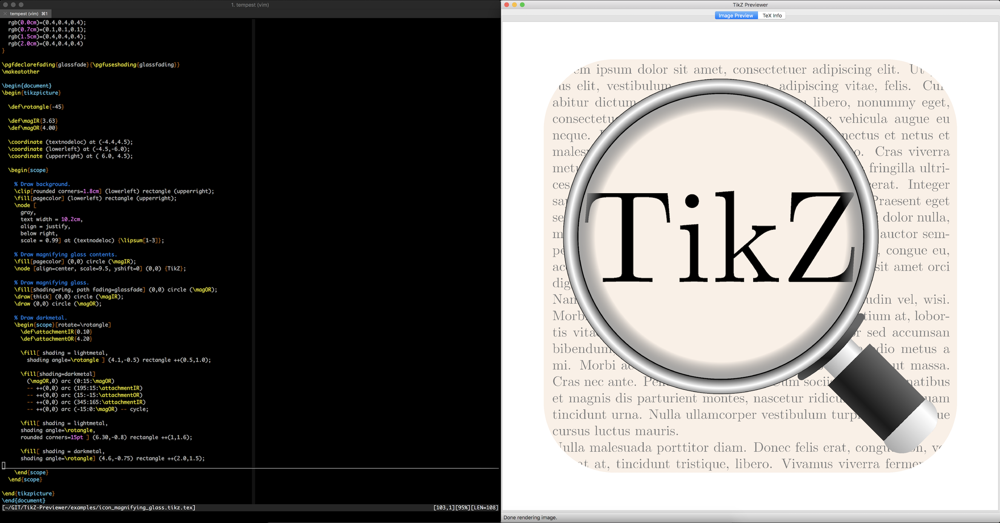

***

**Caution: this is pre-release software.**

**This software is not stable and not recommended for production use.  It is assumed that the user is willing to build the software, which may include modifying some configuration files before building and manually editing configuration files after building.**

Issues that may need to be dealt with include:

* Updating INCLUDEPATH & LIBS in src/TikZ_Previewer.pro for poppler.
* Generating icons in development/icon (see make_icon.sh).
* Updating the LaTeX command, once built and executed, in <CONFIGDIR>/tikz_previewer_preferences.xml (e.g., /Users/jkulesza/Library/Application Support/TikZ Previewer/tikz_previewer_preferences.xml on macOS).

If issues are encountered building/running/etc., contact Joel A. Kulesza at <a href="mailto:jkulesza@gmail.com">jkulesza@gmail.com</a>.

***

# TikZ Previewer

TikZ Previewer is mainly used to "interactively" render external standalone TikZ
LaTeX (.tex) files.  It does this by monitoring the external file for changes
and rerendering when a change is detected.  This allows the use of a preferred
external editor ([atom](https://atom.io/),
[Emacs](https://www.gnu.org/software/emacs/), [Sublime
Text](https://www.sublimetext.com/), [vim](http://www.vim.org/), etc.) while
still having near real-time feedback similar to other utilities such as [TikZ
Editor](https://github.com/fredokun/TikZ-Editor).

Additional TikZ Previewer capabilities available:

* Easily saving (copying) the rendered PDF to the same directory as the TikZ
  LaTeX file.
* Saving a pixmap image of the rendered PDF to a location of the user's
  choosing.
* Directly printing a pixmap image of the rendered PDF.
* Changing the zoom level of the rendered image.

## Background

The original author of TikZ Previewer used [TikZ
Editor](https://github.com/fredokun/TikZ-Editor) extensively, but found several
features lacking:

* The built-in text editor was convenient, but some operations were simply
  easier in the external editor that was more familiar to the author: vim.
  However, there is no way to interface with an external editor.
* The output image cannot be zoomed.  This is helpful if "counting pixels" to
  ensure proper appearance of a minor component.
* The output image cannot be exported.  The code-centric focus is reasonable;
  however, to quickly make a drawing for external use the ability to export is
  helpful.
* Multiple preambles, and their separation from the actual TikZ code, was
  inconvenient when preamble modification was necessary to achieve specific
  behavior.
* Odd startup behavior whereby menus do not function until the application loses
  and regains focus.

As such, TikZ Previewer was created to operate in concert with an external
editor and to provide this missing functionality.

## To-do List

There are several bugs/features/etc. that still need to be addressed, in no
particular order:

- [ ] Incorporate creation of a TikZ template.
- [ ] Provide optional utility to create pixmaps from rendered PDFs.
- [ ] Handle crash on mid-session .tex file rename.
- [ ] Handle crash on pdflatex hang (experienced once, but cannot be reproduced
  through normal use).
- [ ] Add preferences dialog to allow for easier adjustment.
- [ ] Actually test cross-platform building & deployment.
- [ ] Better-handle multiple file loads/unloads (pixmap scaling needs to be
  reset properly).
- [ ] Better handle and disseminate version, year, etc. information.

# Building

TikZ Previewer is intended to function on Linux, macOS, and Windows.  However,
building and testing has only occurred on macOS 10.12.6 (using Qt 5.10.0 and
libpoppler-qt5 0.62.0, both provided via [Homebrew](https://brew.sh/)) and on OS
X 10.11.6 (using Qt 5.10.0 and libpoppler-qt5 0.57.0, both provided via
[Macports](https://www.macports.org/)).

TikZ Previewer was created in [Qt Creator](http://doc.qt.io/qtcreator/).  As
such, the easiest way to modify and/or build the software is by opening the
`src/TikZ_Previewer.pro` file in Qt Creator and Running (Ctrl-R / ⌘R) the
application.

If one doesn't want to use Qt Creator, the following commands will build TikZ
Previewer:

    mkdir build && cd build && qmake ../src && make

at which point the executable can be moved to the user's preferred location.

Alternatively, the `development` directory has a crude `build.sh` script that
will automate building on the command line (currently only setup for macOS with
a non-standard Homebrew configuration).

## Notes regarding Building

* The Poppler Qt5 library is needed to build.
  - To correct the inclusion of poppler, make sure the `INCLUDEPATH` and `LIBS`
    variables in `src/TikZ_Previewer.pro` are correct.
* The `build.sh` script performs some cleanup of the dynamic library linkages
  for `libpoppler`.  **It is almost certain that including Poppler and these
    subsequent cleanups are fragile and will break on other systems.**
  - This script is only currently functional on macOS.
  - Path and/or dynamic library version cleanup will almost certainly be
    necessary for the `build.sh` script and the scripts it calls.

# Contributors

Contributors to the latest build are listed in
[CONTRIBUTORS.md](CONTRIBUTORS.md).

# Contact Information

The primary contact for TikZ Previewer is Joel A. Kulesza (jkulesza@gmail.com).

# License Information

TikZ Previewer benefits from several open-source projects including:

* [poppler](https://poppler.freedesktop.org/) (GNU General Public License
  version 3)
* [pugixml](https://github.com/zeux/pugixml) (MIT License, see below)
* [Qt](https://www1.qt.io/licensing/) (GNU Lesser General Public License version
  3)

with licensing information listed below.  To comply with the licenses of these
projects, TikZ Previewer is licensed under the GNU General Public License
version 3 as:

    TikZ Previewer is a utility for rendering and (pre)viewing TikZ graphics.

    Copyright (C) 2018 Joel A. Kulesza and other contributors.

    This program is free software: you can redistribute it and/or modify it
    under the terms of the GNU General Public License as published by the Free
    Software Foundation, either version 3 of the License, or (at your option)
    any later version.

    This program is distributed in the hope that it will be useful, but WITHOUT
    ANY WARRANTY; without even the implied warranty of MERCHANTABILITY or
    FITNESS FOR A PARTICULAR PURPOSE.  See the GNU General Public License for
    more details.

    You should have received a copy of the GNU General Public License along with
    this program.  If not, see <https://www.gnu.org/licenses/>.

For more information on GPLv3 see [LICENSE.md](LICENSE.md)).

### pugixml

In compliance with the MIT License, pugixml is licensed as:

    Copyright (c) 2006-2018 Arseny Kapoulkine

    Permission is hereby granted, free of charge, to any person obtaining a copy
    of this software and associated documentation files (the "Software"), to
    deal in the Software without restriction, including without limitation the
    rights to use, copy, modify, merge, publish, distribute, sublicense, and/or
    sell copies of the Software, and to permit persons to whom the Software is
    furnished to do so, subject to the following conditions:

    The above copyright notice and this permission notice shall be included in
    all copies or substantial portions of the Software.

    THE SOFTWARE IS PROVIDED "AS IS", WITHOUT WARRANTY OF ANY KIND, EXPRESS OR
    IMPLIED, INCLUDING BUT NOT LIMITED TO THE WARRANTIES OF MERCHANTABILITY,
    FITNESS FOR A PARTICULAR PURPOSE AND NONINFRINGEMENT. IN NO EVENT SHALL THE
    AUTHORS OR COPYRIGHT HOLDERS BE LIABLE FOR ANY CLAIM, DAMAGES OR OTHER
    LIABILITY, WHETHER IN AN ACTION OF CONTRACT, TORT OR OTHERWISE, ARISING
    FROM, OUT OF OR IN CONNECTION WITH THE SOFTWARE OR THE USE OR OTHER DEALINGS
    IN THE SOFTWARE.
